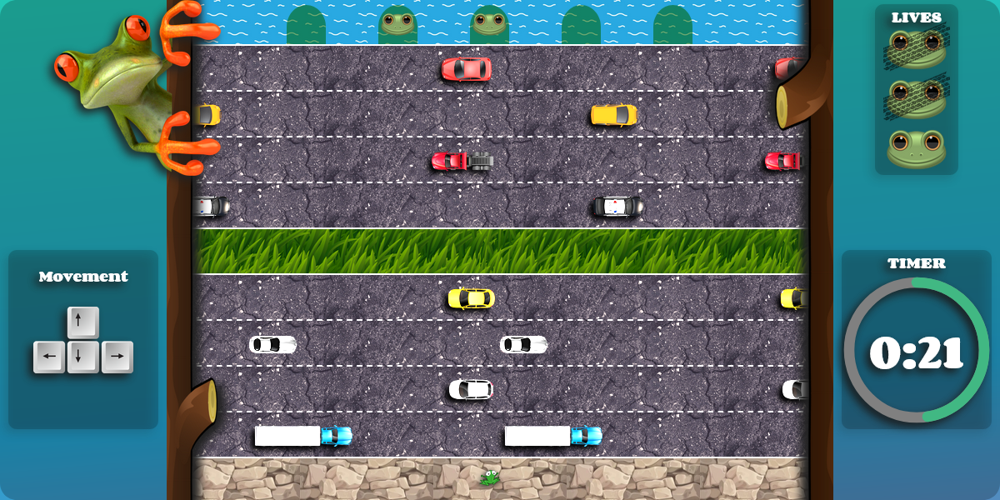

# proyecto1-frogger
_A modded clon of the Atari 2600 game with HTML, CSS and JavaScript vanilla._

## Table of content
- [General info](#general-info)
- [Techologies](#Technologies)
- [How-to play](#How-to-play)
- [Credit](#Credit)

## General info
_This game are a modded clone of the famous frogger game made in 1981 by Konami and distribued by Sega as arcade video game._
_You can find for information in the [Wikipedia](https://en.wikipedia.org/wiki/Frogger)_

## Technologies
_We are used HTML, CSS and vanilla JavaScript wihout any framework._

## How-to play
_You can go to the [Github page](https://thing-bits.github.io/proyecto1-frogger) Or clone the repository localy and open index.html_

## Credit
_This games are made together with @thing-bits @SirAllap and @adservador._  
_Graphic are from [Freepik](https://www.freepik.com/), [freeiconspng](https://www.freeiconspng.com/), [pngwing](https://www.pngwing.com), [classicgaming](http://www.classicgaming.cc/classics/frogger/) and some google search_ `(Thank to the respective autors)`.